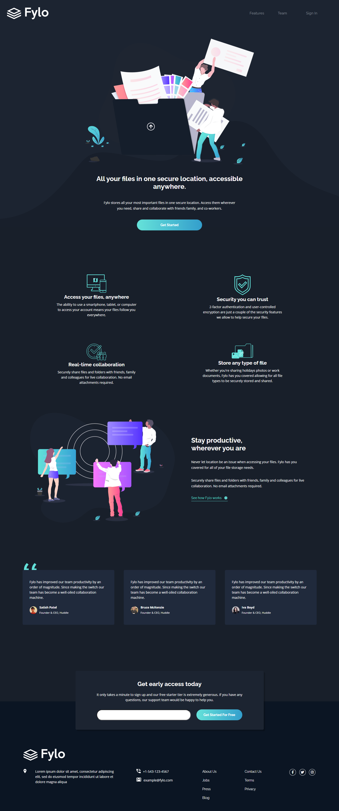
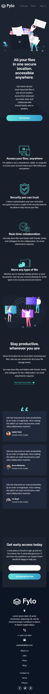
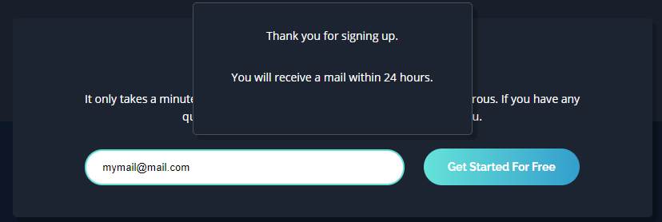

# Frontend Mentor - Fylo dark theme landing page solution
  

### The challenge

Users should be able to:

- View the optimal layout for the app depending on their device's screen size
- See hover states for all interactive elements on the page

### Screenshot

Computer view

Mobile view

Email validation menu

### Built with

- HTML5
- CSS
- Javascript
- Flexbox
- Grid

### What I learned

The layout was not that easy to setup. I added a message when you click on the "Get started for free" button and put a working mail address.